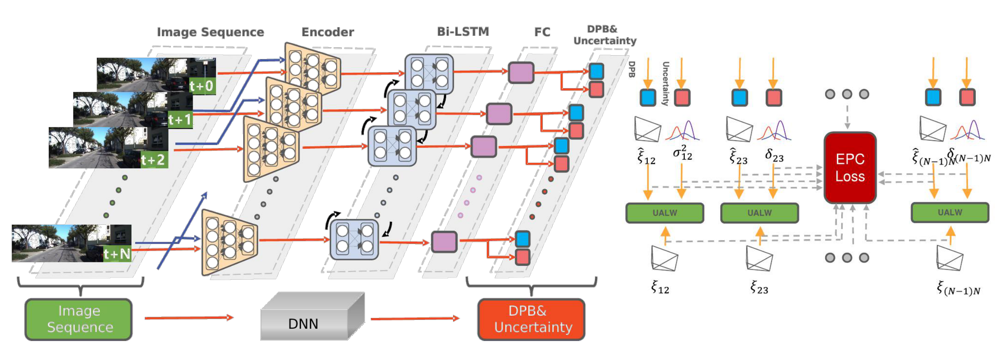
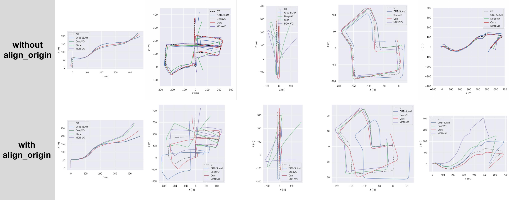
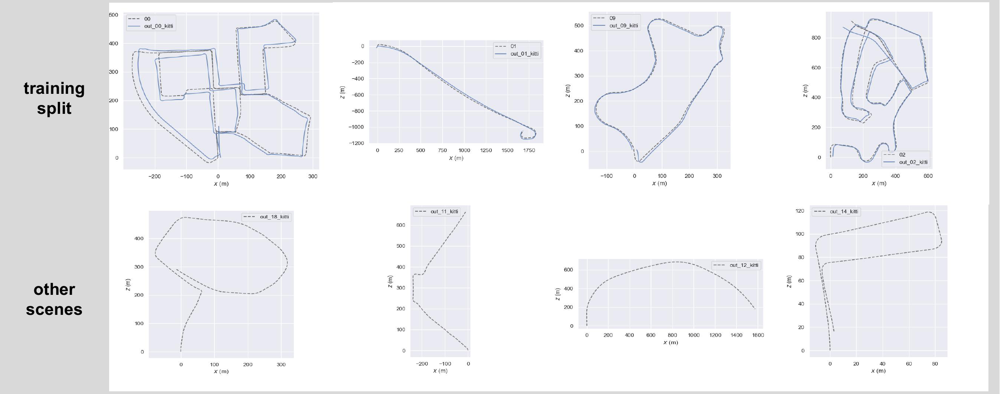
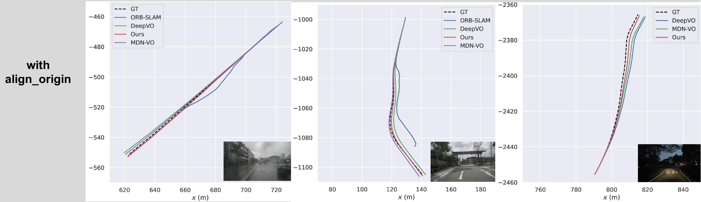
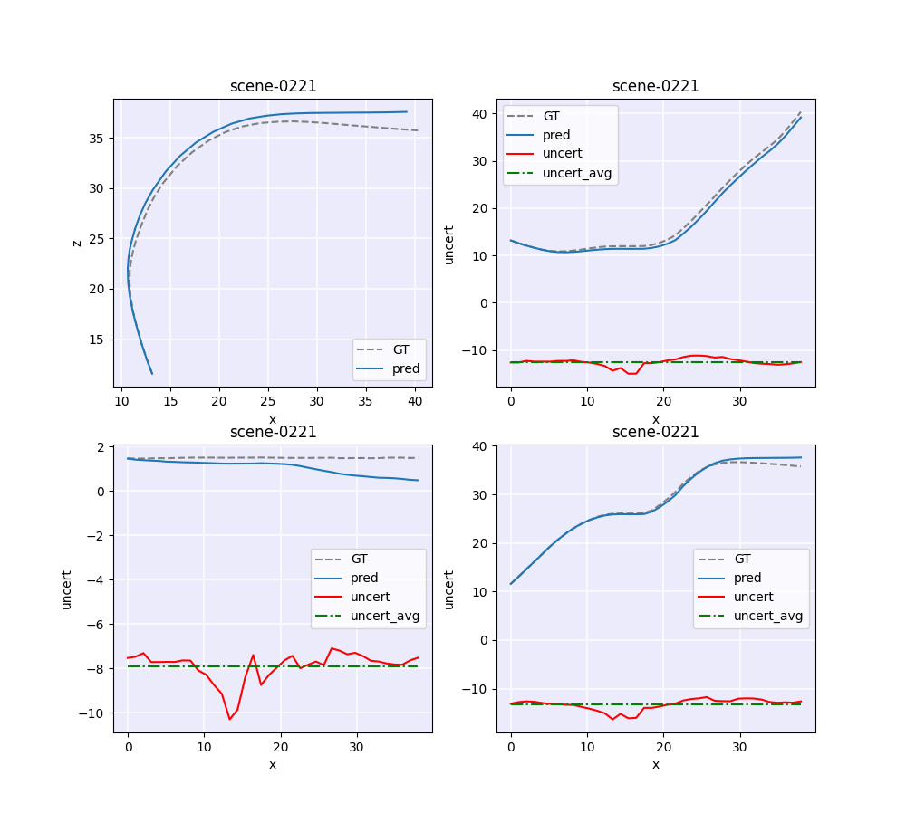

# PC_VO
PC-VO: Uncertainty-Aware Deep Visual Odometry with Exhaustive Pose Consistency



## ⚙️Code under construction...

## 📊Evaluation

### Env Setup

```bash
conda create -n pcvo python=3.9 & conda activate pcvo
pip install evo matplotlib
```

### Visualize KITTI Results

* For KITTI validation split(03/05/06/07/10):

```bash
cd results/kitti/0x/
evo_traj kitti --ref GT.txt ORB-SLAM.txt DeepVO.txt Ours.txt MDN-VO.txt -vsap --plot_mode xz --align_origin #(optional)
```


* For KITTI others:



##### Visualize nuScenes Results
* for nuScenes(0572/0972/0999)

```bash
cd results/nuscenes/0XXX/
evo_traj kitti --ref GT.txt ORB-SLAM.txt DeepVO.txt Ours.txt MDN-VO.txt -vsap --plot_mode xz --align_origin #(optional)
```



##### Visualize Uncertainty

```bash
python draw_uncert_ablation.py
```


